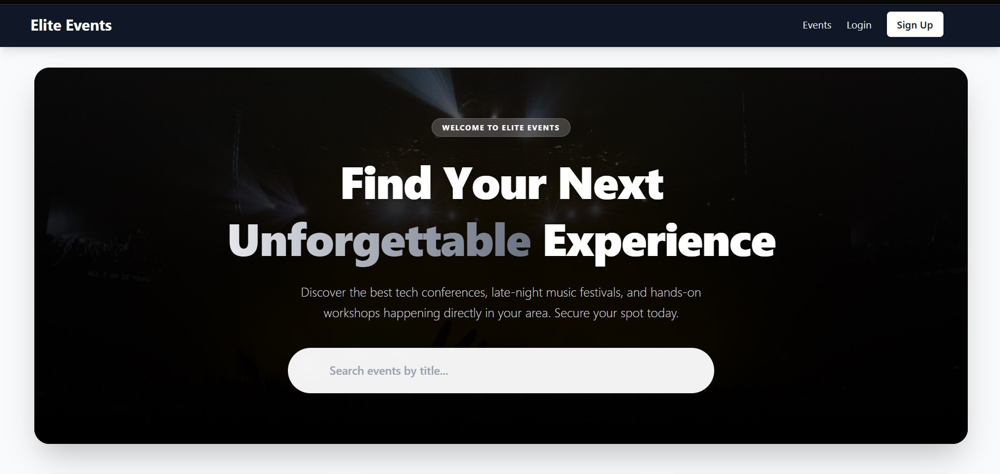
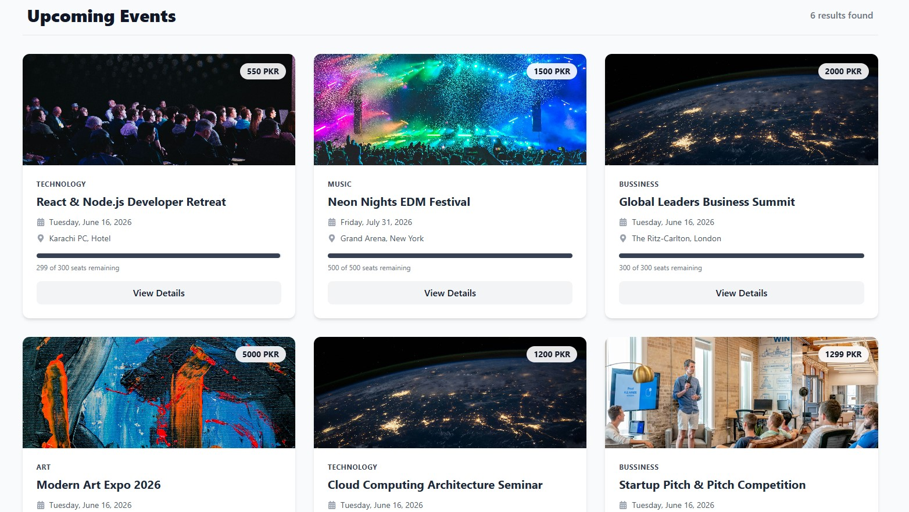
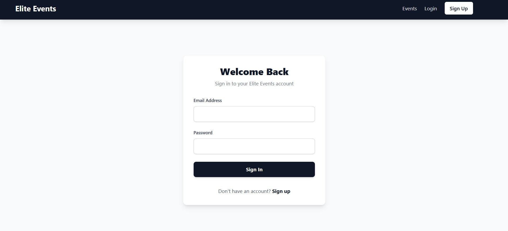
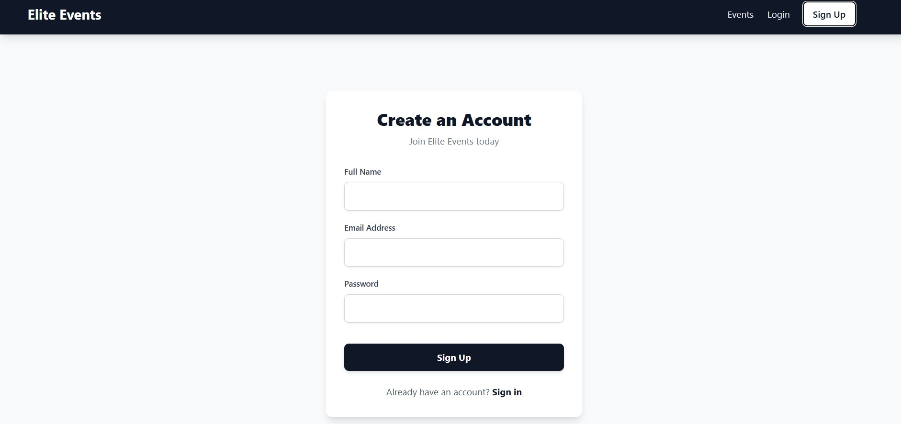
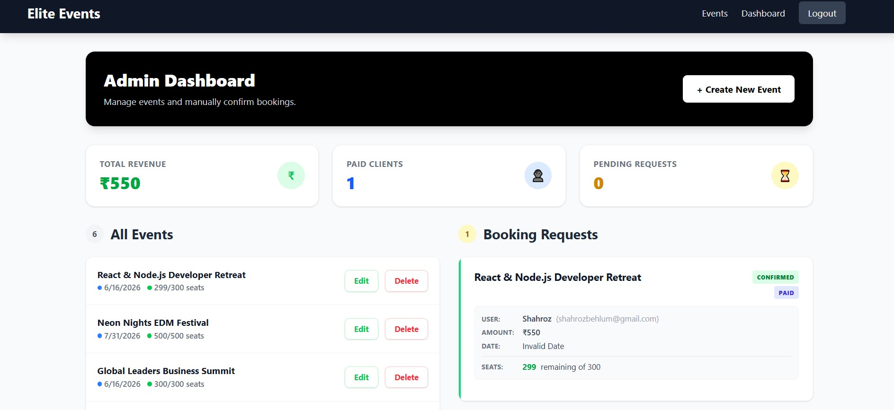
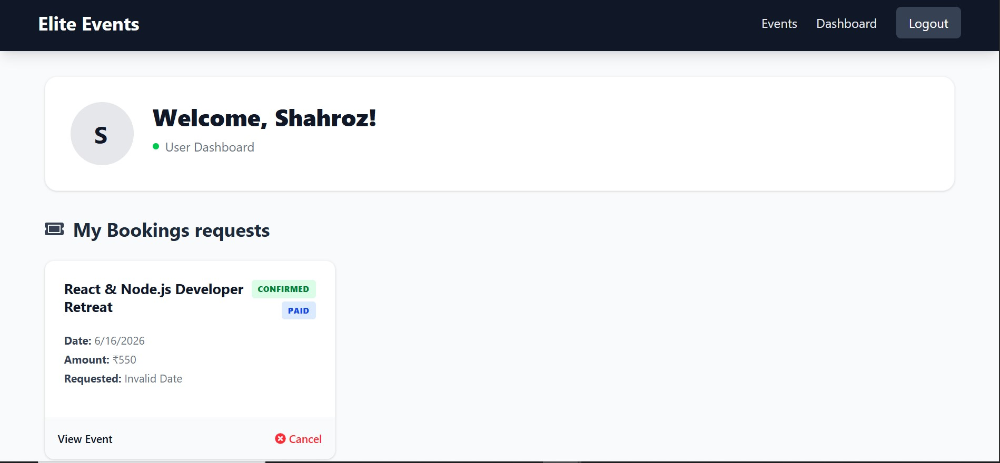
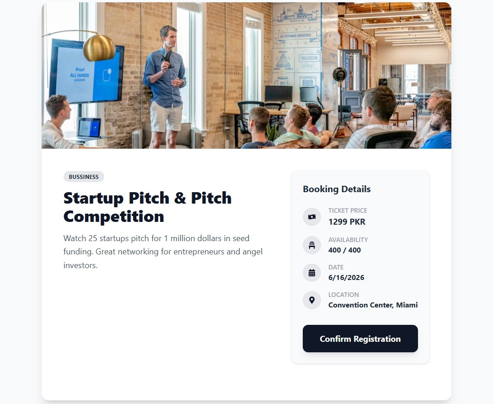
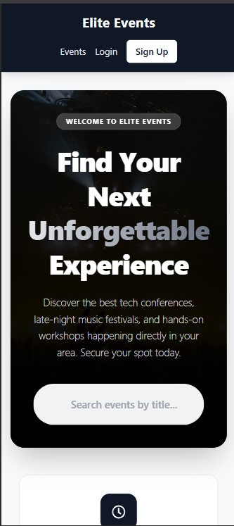
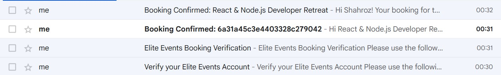

# 🎉 Elite Events Management System

**Elite Events** is a full-stack Event Management System built using the **MERN stack (MongoDB, Express, React, Node.js)**.  
The system provides separate dashboards for **Admin** and **Users**, enabling secure, real-time event and booking management with OTP-based verification.

---

## 🚀 Features

### 👨‍💼 Admin Dashboard
- Create, update, and delete events
- Manage event tickets, seats, and pricing
- View user booking requests
- Confirm or reject event bookings
- Mark bookings as **paid** or **unpaid**
- Send booking confirmation OTP to users
- Secure role-based access control

### 👤 User Dashboard
- Sign up with OTP-based account verification
- Browse and view available events
- Book event tickets
- Receive OTP on booking request
- View booking status (**Pending / Rejected / Confirmed**)
- Cancel or delete event bookings
- Receive confirmation OTP when admin approves booking

---

## ⚙️ Environment Variables Setup

Create a `.env` file in the root of your server and add the following variables:

```env
PORT=5000

MONGODB_URI=your_mongodb_connection_string

EMAIL_USER=your_email@example.com
EMAIL_PASS=your_email_password_or_app_password

JWT_SECRET=your_secret_key

CLOUDINARY_CLOUD_NAME=your_cloud_name
CLOUDINARY_API_KEY=your_api_key
CLOUDINARY_API_SECRET=your_api_secret

```

## 🔐 Authentication & Security
- OTP verification during user signup
- OTP confirmation on event booking
- OTP notification on admin approval
- Role-based access (Admin & User)
- Secure API authentication using JWT

---

## 🛠️ Tech Stack

### Frontend
- React.js
- React Router DOM
- Tailwind CSS
- React Toastify (success & error notifications)

### Backend
- Node.js
- Express.js
- MongoDB
- Mongoose
- JWT Authentication
- OTP verification system

---

## 🎨 UI & UX
- Fully responsive design
- Separate Admin and User dashboards
- Real-time booking status updates
- Clean, modern, and intuitive interface
- Toast notifications for all user actions

---

## 🔄 API Integration
- RESTful API architecture
- Secure frontend-backend communication
- Efficient data handling for events and bookings

---

## 📸 Project Screenshots

### 🏠 Home Page



### 🔐 Login Page


### 📝 Register Page


### 📊 Dashboard



### 🎟️ Event Details Page


### 📱 Mobile View


### 📱 Email Recieves


---

## 📂 Project Structure (Overview)
Event-Management/
├── client/ # React frontend
├── server/ # Node & Express backend
├── Demo Video/ # Project demo video
│ └── demo.mp4
├── .env.example
├── README.md


---

## 📌 Project Highlights
- MERN full-stack architecture
- OTP-based authentication and booking system
- Admin-controlled booking approval flow
- User-friendly dashboard experience
- Scalable and production-ready structure

---

## 🧑‍💻 Author
**SHAHROZ BEHLUM**
**Elite Events Management System**  
Built as a full-stack MERN project for real-world event and booking management.

---

## ⭐ Support
If you like this project, please ⭐ star the repository to show your support!
